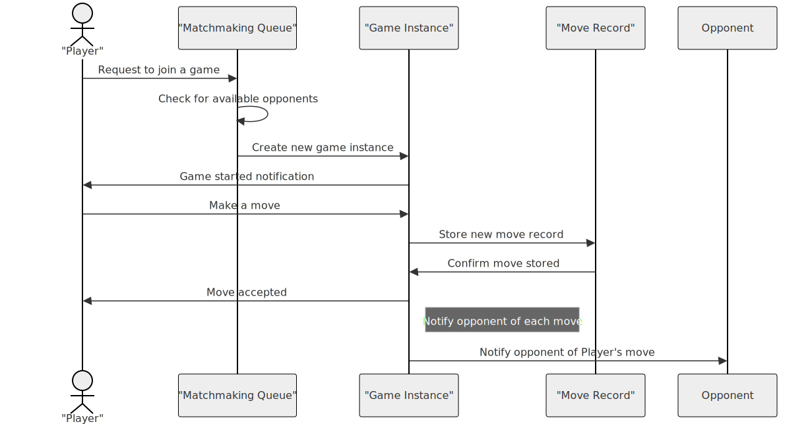

# chess-app

## Conception of the project

### Description

The project is a chess game that can be played by two players. The game is played on a 8x8 board and the players can move the pieces according to the rules of chess. The game is turn-based and the players can only move their own pieces. The game ends when one of the players checkmates the other player. The game is implemented in Laravel and React.

### Use case diagram

    

### Class diagram

    

### Sequence diagram

    

## Activity Diagram

    

