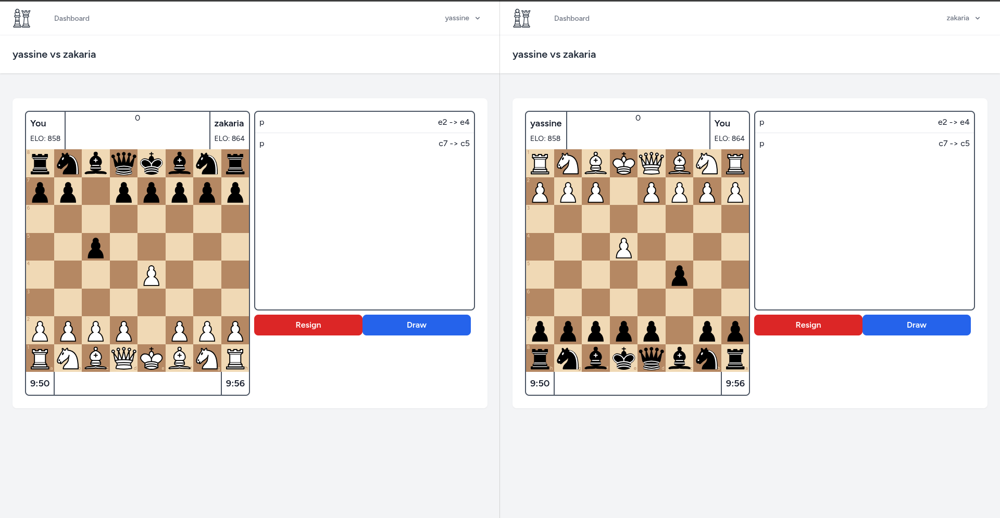

# chess-app

## Introduction

The idea behind this project is to create a chess game that can be played by two players. The game will be implemented using Laravel and React.js, along with Inertia.js. if unfamiliar with inertia.js is, you can find more information about it [here](https://inertiajs.com/who-is-it-for).

I am creating this project, first of all, because I love playing chess. Second, I want to learn more about Laravel and explore Websockets. I'll be using Laravel broadcasting to implement the game's real-time functionality, and I will use react.js just because I am used to it.

The first move ♟️ is to create a conceptual plan for the project. The conception can be found in the `diagrams` folder.

**What is inertia.js?**

Inertia.js lets you quickly build modern single-page React, Vue, and Svelte apps using classic server-side routing and controllers. It provides the best of both worlds by combining the simplicity of classic server-driven apps with the performance of single-page apps.

If you are reading this and you want to test the project, you can clone the project and run the following commands:

```bash
git clone https://github.com/yassine20011/chess-app.git
```

Then you need to install the dependencies:

```bash
composer install
npm install
```

Then you need to create a `.env` file and add the following content:

```bash
cp .env.example .env
```

You will find a `docker-compose` file in the project, you can use it to run postgresql database, you can run the following command to start the database:

```bash
docker compose up -d
```

Then you need to run the migrations:

```bash
php artisan migrate
```

Then you can run the project using the following command:

```
php artisan serve
```

You are not done yet, you need to run the following commands to start the websockets server and the queue listener:

```bash
php artisan reverb:start
# and open a new terminal and run the following command
php artisan queue:listen
# finally open a new terminal and run the following command
npm run dev
```




## Contributions

If you want to contribute to this project, you can fork the project and create a pull request. I will be happy to review your code and merge it if it is relevant.
